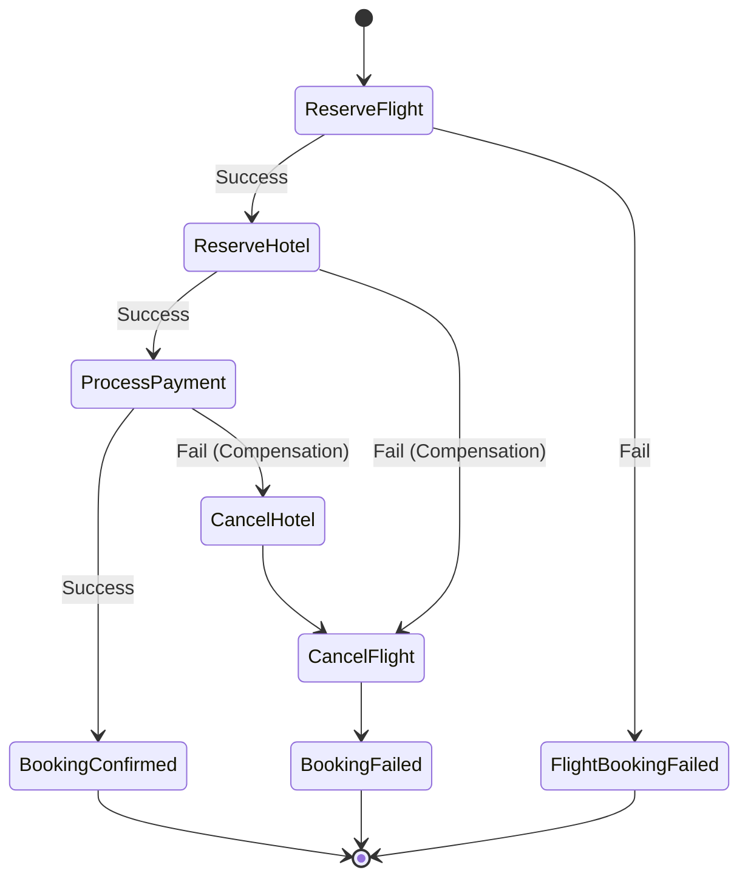

# Serverless Trip Saga Python

AWSサーバーレスアーキテクチャ（Lambda, DynamoDB, Step Functions）と完全なCI/CDパイプライン（CodePipeline, CodeDeploy）を組み合わせたSagaパターン（分散トランザクション）実装ハンズオン。DDD（ドメイン駆動設計）および本番運用を想定した安全なデプロイ戦略を採用。

## アーキテクチャ

オーケストレーションSagaパターンを採用。「Trip（旅行）」を集約ルートとし、フライト予約、ホテル予約、決済の整合性を担保する。



## 技術スタック

* **Language:** Python 3.9+
* **IaC:** AWS CDK (Python)
* **Orchestration:** AWS Step Functions
* **Compute:** AWS Lambda
* **Database:** Amazon DynamoDB (Single Table Design)
* **CI/CD:**
* AWS CodePipeline (パイプライン管理)
* AWS CodeBuild (テスト・ビルド)
* AWS CodeDeploy (Lambdaのカナリア/段階的デプロイ)


* **Libraries:**
* `aws-lambda-powertools`: ログ、トレース、冪等性
* `pydantic`: モデル定義、検証


## シナリオ

1. **Reserve Flight**: フライト座席確保
2. **Reserve Hotel**: ホテル部屋確保
3. **Process Payment**: 決済実行
4. **Completion**: 予約確定

**補償トランザクション**:
決済失敗等のエラー発生時、確保済みのホテル・フライトを自動キャンセルし、結果整合性を維持する。

## CI/CDとデプロイ戦略

本プロジェクトはGitOpsライクな自動デプロイを採用。

1. **Pipeline**: `main` ブランチへのプッシュをトリガーにCodePipelineが起動。
2. **Build & Test**: CodeBuildにてユニットテスト、Lintチェック、CDK Synthを実行。
3. **Safe Deployment**: CodeDeployを使用し、Lambda関数を段階的に更新（例: `Linear10PercentEvery1Minute`）。新バージョンにエラーが発生した場合、自動ロールバックを行う。

## ディレクトリ構成

```text
serverless-trip-saga-python/
├── app.py                   # CDKエントリーポイント
├── cdk.json
├── infrastructure/          # インフラ定義
│   ├── pipeline_stack.py    # CodePipeline/CodeBuild定義
│   ├── app_stack.py         # アプリケーションスタック
│   ├── state_machine.py     # Step Functions定義
│   └── database.py          # DynamoDB定義
├── src/                     # アプリケーションコード
│   ├── shared/              # 共通ライブラリ
│   └── trip/                # Tripコンテキスト
│       ├── domain/          # ビジネスロジック
│       ├── adapters/        # リポジトリ
│       └── handlers/        # Lambdaハンドラー
├── tests/                   # ユニットテスト・E2Eテスト
└── buildspec.yml            # CodeBuild定義書

```

## セットアップ手順

### 前提条件

* AWS CLI
* Node.js & AWS CDK
* Python 3.9+ & Poetry (または pip)
* Docker (Lambdaビルド用)
* GitHub Personal Access Token (CodePipeline連携用)

### 初回デプロイ（パイプライン構築）

初回のみ手動でパイプライン自体をデプロイする。以降はGit Pushにより自動化される。

```bash
# 1. リポジトリのクローン
git clone https://github.com/YOUR_USERNAME/serverless-trip-saga-python.git
cd serverless-trip-saga-python

# 2. 依存関係インストール
python -m venv .venv
source .venv/bin/activate
pip install -r requirements.txt

# 3. パイプラインスタックのデプロイ
cdk deploy PipelineStack

```

## テストと検証

デプロイ完了後、以下のスクリプトまたはAWSコンソールにて動作を確認する。

```bash
# 正常系テスト（Saga完了フロー）
python scripts/test_happy_path.py

# 異常系テスト（補償トランザクションフロー）
python scripts/test_compensation.py

```

## ライセンス

MIT
