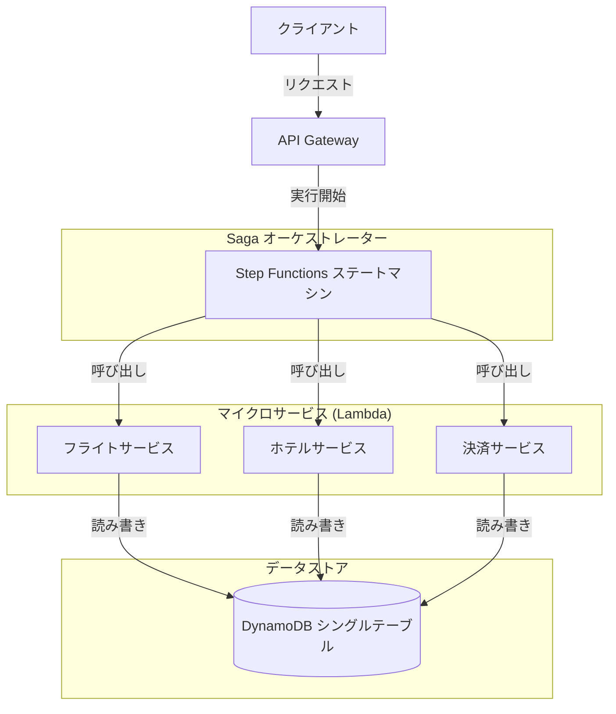
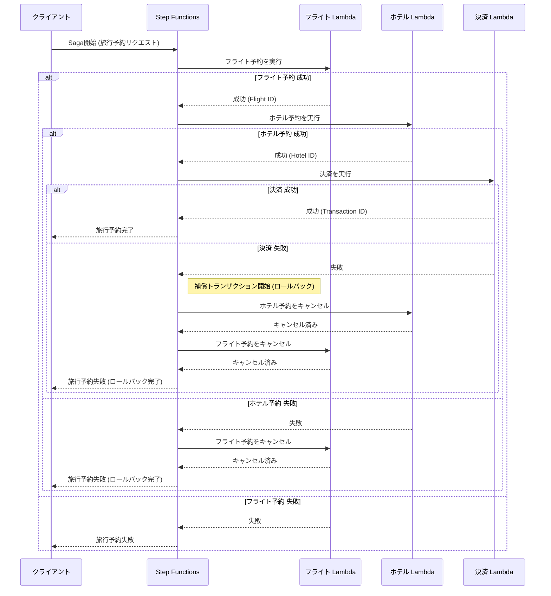
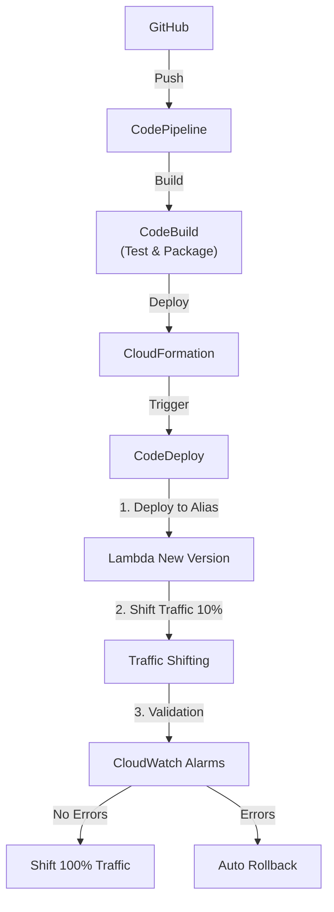

# Architecture & Design

## 1. Architecture Overview

本プロジェクトでは、AWSサーバーレスサービスを活用し、堅牢でスケーラブルな「トラベル予約システム」を構築します。
アーキテクチャは **Orchestration-based Saga Pattern** を採用し、AWS Step Functions を中心に据えます。
また、本番運用を見据え、**CI/CDパイプライン** と **安全なデプロイ戦略 (Canary Release)** を組み込みます。

### 1.1 System Architecture (システム構成図)
AWSリソースの構成図です。Step Functionsがオーケストレーターとなり、各Lambda関数を呼び出します。データは単一のDynamoDBテーブルに集約されます。



### 1.2 Saga Orchestration Flow (Sagaフロー シーケンス図)
正常系と、決済失敗時の補償トランザクション（ロールバック）の流れを示します。



### 1.3 CI/CD & Deployment Strategy
コードのコミットから、CodeDeployを用いた段階的デプロイまでのパイプラインです。


---

## 2. Design Decisions (ADR)

### 2.1. Saga Pattern: Orchestration over Choreography

分散トランザクションの管理手法として、**Orchestration (AWS Step Functions)** を採用します。

*   **選定理由:**
    *   **可視化と追跡:** フローの状態（現在どこまで進んだか、どこで失敗したか）がStep Functionsのコンソールで一目瞭然であり、運用時のトラブルシューティングが容易。
    *   **複雑性の管理:** Choreography（イベント駆動でのサービス間連携）はサービスが増えると依存関係が複雑化し、「誰が何を知っているか」が不明確になりがちですが、Orchestrationは中央のコーディネーターがフローを制御するため、ロジックが分散しません。
    *   **補償トランザクションの実装:** 失敗時のロールバックフローをステートマシンとして明示的に定義できるため、実装ミスを防ぎやすい。

### 2.2. Domain-Driven Design (DDD) & DynamoDB Design

#### Domain Model & Aggregates
本システムにおけるドメインモデル（集約）を以下のように定義します。

*   **Trip (Aggregate Root)**:
    *   旅行予約プロセス全体を統括するルート集約。
    *   一貫性境界（Consistency Boundary）として機能し、配下のエンティティの整合性を保証します。
*   **Member Aggregates / Entities**:
    *   **FlightReservation**: フライト予約の詳細情報。
    *   **HotelBooking**: ホテル予約の詳細情報。
    *   **PaymentTransaction**: 決済処理の記録。

これらは論理的には独立した概念ですが、データ整合性の観点から `Trip` IDを共有キーとして管理されます。

本プロジェクトでは、複雑なビジネスロジックとAWSインフラストラクチャを分離するため、明確なレイヤーアーキテクチャを採用します。

#### Layered Architecture (Directory Structure & Responsibilities)
各Lambda関数内は以下のレイヤーで構成し、依存関係を一方向に保ちます。

1.  **Handlers (`handlers/`)**:
    *   Lambdaのエントリーポイント。
    *   リクエストの受け取り、パラメータ検証（Pydantic等）、Application Serviceの呼び出し、レスポンスの返却のみを担当します。
    *   ビジネスロジックは一切持ちません。
2.  **Applications (`applications/`)**:
    *   ユースケースを実現する進行役。
    *   Domain Modelのメソッド呼び出しや、Repository（Infrastructure）を利用したデータの永続化を調整します。
    *   アトミックなトランザクション境界を定義します。
3.  **Models / Domain (`domain/` or `models/`)**:
    *   **純粋なPythonコード** で構成されるビジネスロジックの中心。
    *   **重要:** `boto3` などのAWS SDKや、外部ライブラリへの依存を極力排除します。これにより、単体テストの容易性とポータビリティを確保します。
4.  **Infrastructures / Adapters (`adapters/` or `infrastructures/`)**:
    *   DynamoDB, SNS, SQSなどのAWSリソースへの具体的なアクセス実装（Repositoryの実装）。
    *   Domain層で定義されたインターフェース（Abstract Base Class）を実装します（依存性逆転の原則）。

#### DynamoDB Design with Outbox Pattern & CQRS
データの整合性とパフォーマンスを両立させるため、**Outbox Pattern** と **CQRS (Command Query Responsibility Segregation)** を採用します。

##### Single Table Design Schema
すべてのデータを1つのテーブル `TripSagaTable` に格納します。Outboxパターンを採用するため、`OUTBOX` アイテムが追加されています。

*   **Partition Key (PK):** `TRIP#{trip_id}`
    *   すべての関連データ（エンティティとイベント）は同一の Trip ID に紐づくため、同じパーティションに配置することでトランザクション範囲を限定します。
*   **Sort Key (SK):** Entity Type Prefix
    *   `METADATA` : 旅行全体のメタデータ
    *   `FLIGHT#{flight_id}` : フライト予約詳細
    *   `HOTEL#{hotel_id}` : ホテル予約詳細
    *   `PAYMENT#{payment_id}` : 決済詳細
    *   **`OUTBOX#{event_id}`** : **[New]** イベント通知待ちのレコード (TTLにより自動削除、またはStreams処理後に削除)

*   **Global Secondary Index (GSI):**
    *   基本的な検索要件（例: ステータスごとのフィルタリング）に対応するための汎用GSI。
    *   **Index Name:** `GSI1`
    *   **PK:** `GSI1PK` / **SK:** `GSI1SK`
    *   *Note: 複雑な検索（全文検索や多重フィルタ）は、後述のCQRS Viewパターンで対応しますが、単純なアクセスパターンにはこのGSIを利用してオーバーヘッドを避けます。*

*   **Transactional Writes & Outbox Pattern:**
    *   ドメインの状態変更（例: 予約確定）と、それに伴うイベント発行（例: 「予約確定イベント」）は、**DynamoDB TransactWriteItems** を用いて同一トランザクション内でアトミックにコミットします。
    *   イベントは `OUTBOX#{event_id}` アイテムとしてテーブル内に保存されます。
    *   **DynamoDB Streams** が `Outbox` アイテムの変更を検知し、後続のLambda（Dispatcher）が確実にイベントバス（EventBridge/SNS）へメッセージを発行します。これにより、分散システムにおける「二重書き込み問題」を回避します。

*   **CQRS (Separation of Command and Query):**
    *   **Command (Write):** 上記のSingle Table Designを用いた正規化されたデータ構造への書き込み。
    *   **Query (Read):** 複雑な検索要件（例: 「過去1年間のキャンセル済み旅行一覧」）に対しては、DynamoDB Streamsをトリガーに、検索に最適化された **View Table (またはElasticsearch/OpenSearch)** を非同期に構築します。これにより、書き込みモデルへの負荷をかけずに柔軟な検索が可能になります。

### 2.3. Deployment Strategy: Canary Release via AWS CodeDeploy

Lambda関数の更新において、**CodeDeployを使用した段階的デプロイ（Canary/Linear）** を採用します。
(中略)

### 2.4. Observability Strategy with Datadog

サーバーレスアーキテクチャの可視化と運用監視のため、Datadogを活用した包括的なObservability戦略を採用します。

*   **Distributed Tracing (APM):**
    *   **Step Functions to Lambda:** Step Functionsの実行から各Lambda関数の詳細処理までを一気通貫でトレースします。
    *   **Log Context Injection:** Lambdaが出力するログ（JSON形式推奨）に `dd.trace_id` や `dd.span_id` を自動注入します。これにより、Datadog上でログとトレースを相互に紐付けて調査可能にします。
*   **Custom Metrics & Dashboards:**
    *   標準のAWSメトリクス（Invocation, Error）に加え、ビジネスKPIをカスタムメトリクスとして送信します。
        *   例: `trip.booking.completed`, `trip.compensation.triggered`
    *   Saga全体の健全性を可視化する専用ダッシュボードを構築し、ビジネス影響を即座に把握します。
*   **Metric Streams:**
    *   CloudWatch Metric Streamsを利用し、AWSメトリクスを低遅延（数分以内）でDatadogへ転送し、リアルタイムに近い監視を実現します。

### 2.5. Dependency Management with Lambda Layers

デプロイパッケージの軽量化とビルド時間の短縮のため、共通ライブラリは **Lambda Layer** として管理します。

*   **Common Dependencies Layer:**
    *   `aws-lambda-powertools`, `pydantic`, `datadog-lambda` などの頻繁に変更されない重量級ライブラリをLayerに分離。
    *   各Lambda関数のコード修正時には、アプリケーションコードのみをデプロイすれば良いため、デプロイメントパイプラインが高速化します。

---

## 3. Project Setup Guide (Hands-on Preparation)

Lambda関数の更新において、**CodeDeployを使用した段階的デプロイ（Canary/Linear）** を採用します。

*   **Why CodeDeploy?**
    *   **リスク軽減:** 新しいバージョンのLambdaを一気に全ユーザーに公開するのではなく、例えば「最初の10分間は10%のトラフィックのみ」流すことで、バグがあった場合の影響範囲を最小限に抑えられます。
    *   **自動ロールバック:** 新バージョンでエラー率が増加した場合、自動的に旧バージョンに切り戻す（ロールバック）設定が可能で、システムの可用性を維持できます。
    *   **実務標準:** ミッションクリティカルなシステムでは必須級の要件です。

---

## 3. Project Setup Guide (Hands-on Preparation)

以下の手順に従って、プロジェクトの初期化を行ってください。

### Prerequisites
*   Python 3.9+
*   Node.js 18+
*   AWS CLI (configured)
*   AWS CDK CLI (`npm install -g aws-cdk`)

### Step 1: Initialize Project
プロジェクト用ディレクトリを作成し、CDK Pythonプロジェクトを初期化します。

```bash
# プロジェクトディレクトリへ移動 (現在地に展開する場合は不要)
# mkdir serverless-trip-saga-python && cd serverless-trip-saga-python

# CDKプロジェクトの初期化
cdk init app --language python

# 不要な初期ファイルの説明
# source.bat はWindows用なのでMac/Linuxでは削除してOK
rm source.bat
```

### Step 2: Virtual Environment Setup
Pythonの仮想環境を有効化します。

```bash
# 仮想環境の作成 (cdk init で作成されているはずですが念のため)
python3 -m venv .venv

# 仮想環境の有効化 (Mac/Linux)
source .venv/bin/activate

# Windowsの場合:
# .venv\Scripts\activate
```

### Step 3: Install Dependencies
必要なライブラリをインストールします。

`requirements.txt` を開き、以下の内容を追加・修正してください。
(AWS Lambda Powertools と Pydantic を追加します)

```text
aws-cdk-lib==2.114.1
constructs>=10.0.0
aws-lambda-powertools
pydantic
```

その後、インストールを実行します。

```bash
pip install -r requirements.txt
```

### Step 4: Verify Setup
セットアップが完了したか確認します。

```bash
cdk list
```

エラーなくスタック名（例: `ServerlessTripSagaPythonStack`）が表示されれば準備完了です。
