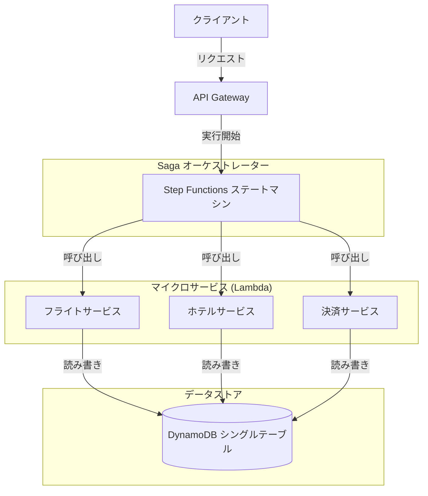
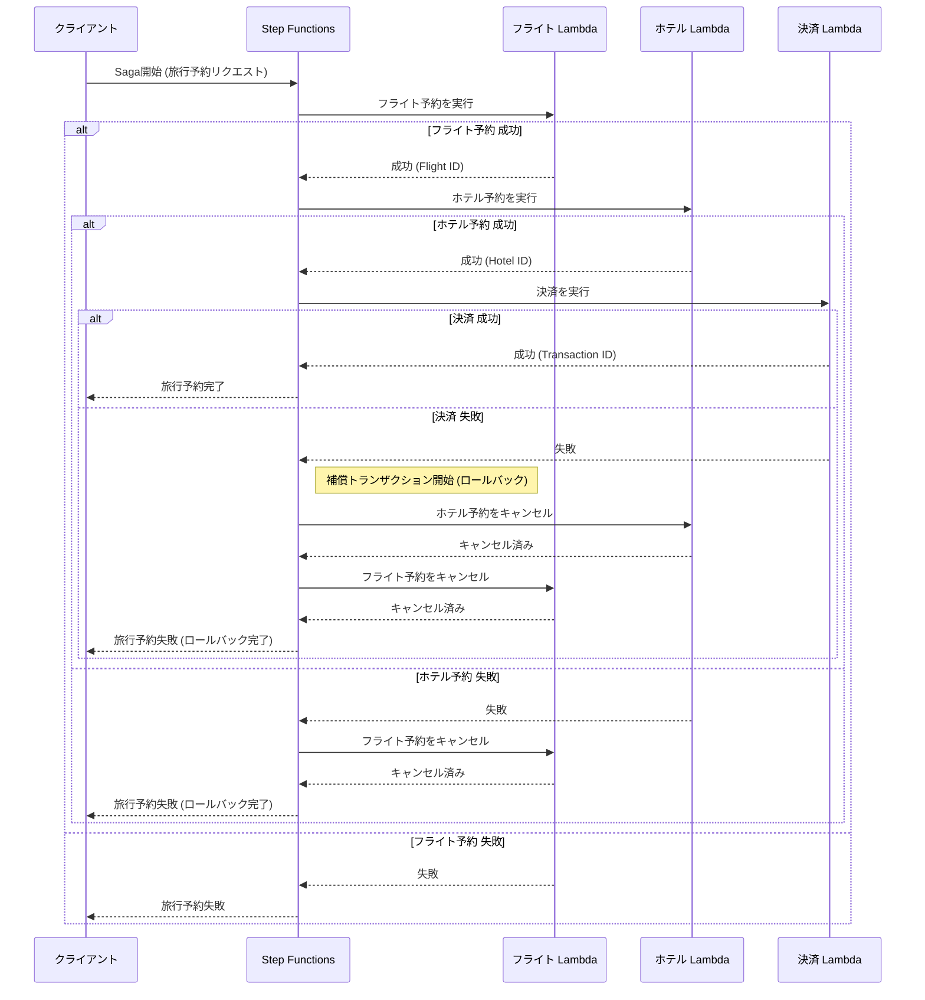
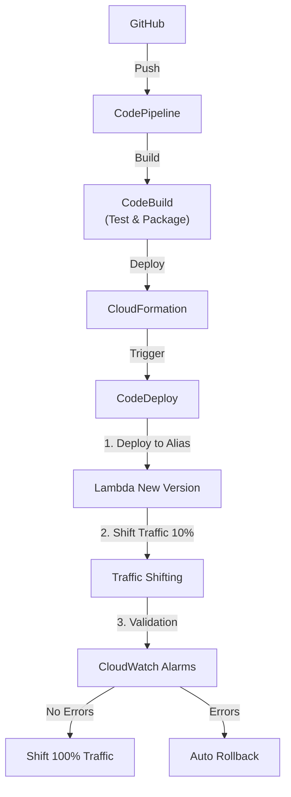

# Architecture & Design

## 1. Architecture Overview

本プロジェクトでは、AWSサーバーレスサービスを活用し、堅牢でスケーラブルな「トラベル予約システム」を構築します。
アーキテクチャは **Orchestration-based Saga Pattern** を採用し、AWS Step Functions を中心に据えます。
また、本番運用を見据え、**CI/CDパイプライン** と **安全なデプロイ戦略 (Canary Release)** を組み込みます。

### 1.1 System Architecture (システム構成図)
AWSリソースの構成図です。Step Functionsがオーケストレーターとなり、各Lambda関数を呼び出します。データは単一のDynamoDBテーブルに集約されます。



### 1.2 Saga Orchestration Flow (Sagaフロー シーケンス図)
正常系と、決済失敗時の補償トランザクション（ロールバック）の流れを示します。



### 1.3 CI/CD & Deployment Strategy
コードのコミットから、CodeDeployを用いた段階的デプロイまでのパイプラインです。


---

## 2. Design Decisions (ADR)

### 2.1. Saga Pattern: Orchestration over Choreography

分散トランザクションの管理手法として、**Orchestration (AWS Step Functions)** を採用します。

*   **選定理由:**
    *   **可視化と追跡:** フローの状態（現在どこまで進んだか、どこで失敗したか）がStep Functionsのコンソールで一目瞭然であり、運用時のトラブルシューティングが容易。
    *   **複雑性の管理:** Choreography（イベント駆動でのサービス間連携）はサービスが増えると依存関係が複雑化し、「誰が何を知っているか」が不明確になりがちですが、Orchestrationは中央のコーディネーターがフローを制御するため、ロジックが分散しません。
    *   **補償トランザクションの実装:** 失敗時のロールバックフローをステートマシンとして明示的に定義できるため、実装ミスを防ぎやすい。

### 2.2. Domain-Driven Design (DDD) & DynamoDB Design

#### Bounded Context & Aggregates
本システムは「予約（Booking）」という大きなコンテキストの中に、以下の集約が存在すると定義します。ただし、今回は学習用のため、1つの「Booking」集約としてまとめ、その中に各リソースの状態を持たせる簡易的なアプローチ（あるいは単一テーブル内でのパーティション分割）を取りますが、ここではスケーラビリティを考慮し、論理的に分離されたサービスが共通のテーブル（Single Table Design）を利用するパターンを想定します。

*   **Aggregates:**
    1.  **FlightReservation:** フライト予約情報。
    2.  **HotelBooking:** ホテル予約情報。
    3.  **PaymentTransaction:** 決済情報。

#### DynamoDB Single Table Design
すべてのデータを1つのテーブル `TripSagaTable` に格納します。

*   **Partition Key (PK):** `TRIP#{trip_id}`
    *   すべての関連データは同一の Trip ID に紐づくため、同じパーティションに配置することでクエリ効率を高めます。
*   **Sort Key (SK):** Entity Type Prefix
    *   `METADATA` : 旅行全体のメタデータ
    *   `FLIGHT#{flight_id}` : フライト予約詳細
    *   `HOTEL#{hotel_id}` : ホテル予約詳細
    *   `PAYMENT#{payment_id}` : 決済詳細

**メリット:**
*   1回のクエリ（`Query` API）で、特定の旅行に関する全データ（フライト、ホテル、決済状況）を取得可能。
*   ACIDトランザクションが必要な場合、`TransactWriteItems` を利用しやすい。

#### Global Secondary Index (GSI) Design
検索要件（Access Patterns）の拡大に対応するため、汎用的なGSIを1つ追加します。これにより、メインのPK（Trip ID）以外での検索が可能になります。

*   **Index Name:** `GSI1`
*   **GSI Partition Key (PK):** `GSI1PK`
*   **GSI Sort Key (SK):** `GSI1SK`

**主な利用パターン:**
1.  **ステータス別・日付順の旅行検索** (「失敗した旅行一覧」など)
    *   対象データ: 旅行メタデータ (`METADATA`)
    *   **GSI1PK:** `STATUS#{status}` (例: `STATUS#FAILED`, `STATUS#COMPLETED`)
    *   **GSI1SK:** `DATE#{created_at}` (作成日時の時系列順)

### 2.3. Deployment Strategy: Canary Release via AWS CodeDeploy

Lambda関数の更新において、**CodeDeployを使用した段階的デプロイ（Canary/Linear）** を採用します。

*   **Why CodeDeploy?**
    *   **リスク軽減:** 新しいバージョンのLambdaを一気に全ユーザーに公開するのではなく、例えば「最初の10分間は10%のトラフィックのみ」流すことで、バグがあった場合の影響範囲を最小限に抑えられます。
    *   **自動ロールバック:** 新バージョンでエラー率が増加した場合、自動的に旧バージョンに切り戻す（ロールバック）設定が可能で、システムの可用性を維持できます。
    *   **実務標準:** ミッションクリティカルなシステムでは必須級の要件です。

---

## 3. Project Setup Guide (Hands-on Preparation)

以下の手順に従って、プロジェクトの初期化を行ってください。

### Prerequisites
*   Python 3.9+
*   Node.js 18+
*   AWS CLI (configured)
*   AWS CDK CLI (`npm install -g aws-cdk`)

### Step 1: Initialize Project
プロジェクト用ディレクトリを作成し、CDK Pythonプロジェクトを初期化します。

```bash
# プロジェクトディレクトリへ移動 (現在地に展開する場合は不要)
# mkdir serverless-trip-saga-python && cd serverless-trip-saga-python

# CDKプロジェクトの初期化
cdk init app --language python

# 不要な初期ファイルの説明
# source.bat はWindows用なのでMac/Linuxでは削除してOK
rm source.bat
```

### Step 2: Virtual Environment Setup
Pythonの仮想環境を有効化します。

```bash
# 仮想環境の作成 (cdk init で作成されているはずですが念のため)
python3 -m venv .venv

# 仮想環境の有効化 (Mac/Linux)
source .venv/bin/activate

# Windowsの場合:
# .venv\Scripts\activate
```

### Step 3: Install Dependencies
必要なライブラリをインストールします。

`requirements.txt` を開き、以下の内容を追加・修正してください。
(AWS Lambda Powertools と Pydantic を追加します)

```text
aws-cdk-lib==2.114.1
constructs>=10.0.0
aws-lambda-powertools[all]
pydantic
```

その後、インストールを実行します。

```bash
pip install -r requirements.txt
```

### Step 4: Verify Setup
セットアップが完了したか確認します。

```bash
cdk list
```

エラーなくスタック名（例: `ServerlessTripSagaPythonStack`）が表示されれば準備完了です。
