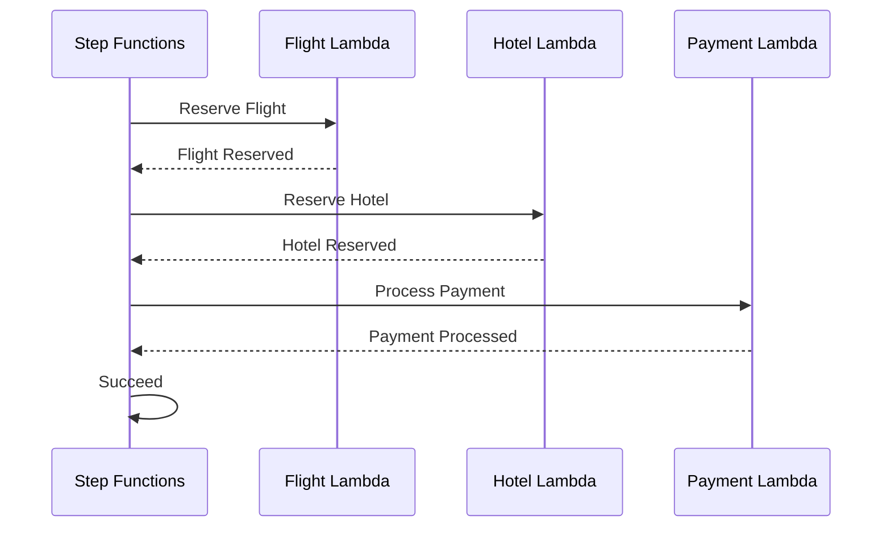

# Hands-on 06: Saga Orchestration (Step Functions)

## 概要

このハンズオンでは、旅行予約システムにおける複数サービス（フライト・ホテル・決済）の連携を Step Functions で実装します。Saga パターンの正常系フローを構築し、各ステップの結果を result_path で保持することで、後続の補償トランザクション（キャンセル処理）にも対応できる設計を学びます

## 目的
* 正常系フローの構築

## 定義フロー
Start -> Reserve Flight -> Reserve Hotel -> Process Payment -> Succeed



## CDK実装
* `tasks.LambdaInvoke` を使用してチェーン (`.next()`) を定義。
* **データの受け渡し (Context Propagation)**:
    * 単純な `output_path="$.Payload"` ではなく、**`result_path`** の使用を推奨します（例: `result_path="$.results.flight"`）。
    * これにより、前のステップの入力データ（予約IDや顧客情報）を上書きせずに保持したまま、後続のステップや補償トランザクション（キャンセル処理）で参照可能になります。
* **AWSサービスエラーへのリトライ (`retry_on_service_exceptions`)**:
    * `retry_on_service_exceptions=True` を設定することで、一時的なAWSサービスエラー（ネットワーク障害、スロットリングなど）に対して自動リトライが行われます。
    * **前提条件**: リトライを安全に行うためには、各Lambda関数が **冪等性（べきとう性）** を保証している必要があります。本プロジェクトでは、DynamoDBの条件付き書き込み（`attribute_not_exists`）により、同一リクエストの重複実行を防止しています（詳細は Hands-on 04, 05 を参照）。

### ファイル構成
```
infra/
├── constructs/
│   ├── __init__.py
│   ├── database.py      # Hands-on 02 で作成済み
│   ├── layers.py        # Hands-on 03 で作成済み
│   ├── functions.py     # Hands-on 04, 05 で作成済み
│   └── orchestration.py # Step Functions Construct (今回追加)
```

### infra/constructs/orchestration.py
```python
from aws_cdk import (
    aws_stepfunctions as sfn,
    aws_stepfunctions_tasks as tasks,
)
from constructs import Construct

from infra.constructs.functions import Functions


class Orchestration(Construct):
    """Step Functions ステートマシンを管理する Construct"""

    def __init__(
        self,
        scope: Construct,
        id: str,
        functions: Functions,
    ) -> None:
        super().__init__(scope, id)

        # ========================================================================
        # Task Definitions
        # ========================================================================
        reserve_flight_task = tasks.LambdaInvoke(
            self, "ReserveFlight",
            lambda_function=functions.flight_reserve,
            retry_on_service_exceptions=True,
            result_path="$.results.flight",
        )

        reserve_hotel_task = tasks.LambdaInvoke(
            self, "ReserveHotel",
            lambda_function=functions.hotel_reserve,
            retry_on_service_exceptions=True,
            result_path="$.results.hotel",
        )

        process_payment_task = tasks.LambdaInvoke(
            self, "ProcessPayment",
            lambda_function=functions.payment_process,
            retry_on_service_exceptions=True,
            result_path="$.results.payment",
        )

        # ========================================================================
        # State Machine Definition (正常系フロー)
        # ========================================================================
        definition = (
            reserve_flight_task
            .next(reserve_hotel_task)
            .next(process_payment_task)
            .next(sfn.Succeed(self, "BookingSucceeded"))
        )

        self.state_machine = sfn.StateMachine(
            self, "TripBookingStateMachine",
            definition=definition,
        )
```

### infra/constructs/\_\_init\_\_.py (更新)
```python
from .database import Database as Database
from .functions import Functions as Functions
from .layers import Layers as Layers
from .orchestration import Orchestration as Orchestration
```

### serverless_trip_saga_stack.py (更新)
```python
from aws_cdk import Stack
from constructs import Construct
from infra.constructs import Database, Layers, Functions, Orchestration


class ServerlessTripSagaStack(Stack):

    def __init__(self, scope: Construct, construct_id: str, **kwargs) -> None:
        super().__init__(scope, construct_id, **kwargs)

        # Database Construct
        database = Database(self, "Database")

        # Layers Construct
        layers = Layers(self, "Layers")

        # Functions Construct
        fns = Functions(
            self, "Functions",
            table=database.table,
            common_layer=layers.common_layer,
        )

        # Orchestration Construct
        Orchestration(
            self, "Orchestration",
            functions=fns,
        )
```

## ブランチとコミットメッセージ

*   **ブランチ名**: `feature/step-functions`
*   **コミットメッセージ**: `Step Functionsによるオーケストレーション`
