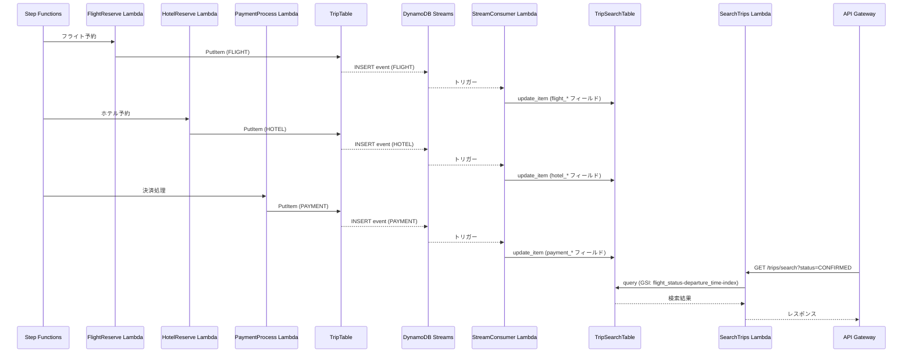

# Hands-on 15: DynamoDB Streams を使った検索用テーブルへのデータ同期

本セクションでは、**DynamoDB Streams** を使って TripTable への書き込みを検索用テーブル (`TripSearchTable`) へ自動同期する仕組みを構築します。Stream Consumer Lambda が CQRS 的に非正規化ドキュメントを組み立て、複合条件検索を可能にする Search Lambda を追加します。

## 目的

1. **DynamoDB Streams の理解**: テーブルへの書き込みをリアルタイムに検知し、イベント駆動でデータを同期する仕組みを学ぶ。
2. **CQRS パターンの実践**: 書き込みテーブル（TripTable）と読み取りテーブル（TripSearchTable）を分離し、検索ユースケースに最適化されたデータ構造を設計する。
3. **非正規化ドキュメントの組み立て**: FLIGHT / HOTEL / PAYMENT の 3 つのエンティティが別タイミングで書き込まれる場合でも `update_item` の部分更新で整合性を保つ方法を学ぶ。
4. **GSI を使ったクエリの実装**: 複合条件（ステータス + 出発日範囲）での絞り込み検索を GSI を活用して実装する。

## 前提条件

- Hands-on 06〜08 が完了していること（Step Functions オーケストレーション + API Gateway が稼働中）。
- `cdk deploy` が完了しており、TripTable と各 Lambda が AWS 上に存在すること。
- AWS CLI v2, `jq`, `python3` が実行可能であること。

---

## 1. DynamoDB Streams とは

### Streams の概念

DynamoDB Streams は、DynamoDB テーブルへの **INSERT / MODIFY / REMOVE** 操作を時系列順にキャプチャし、Lambda などのコンシューマーに配信する機能です。Kinesis Data Streams と類似した仕組みですが、DynamoDB と密結合しており追加コストは最小限です。

```
TripTable (書き込み)
    │
    ├── PutItem (INSERT)
    ├── UpdateItem (MODIFY)
    └── DeleteItem (REMOVE)
           │
           ▼
    DynamoDB Streams
           │
           ▼
    Stream Consumer Lambda
           │
           ▼
    TripSearchTable (読み取り専用)
```

### イベント構造

Streams のイベントレコードは以下の構造を持ちます:

```json
{
  "Records": [
    {
      "eventName": "INSERT",           // INSERT / MODIFY / REMOVE
      "dynamodb": {
        "NewImage": {                  // 書き込み後のアイテム（INSERT/MODIFY）
          "PK": {"S": "TRIP#trip-001"},
          "SK": {"S": "FLIGHT#flight_for_trip-001"},
          "flight_number": {"S": "NH001"},
          "status": {"S": "CONFIRMED"}
        },
        "OldImage": {                  // 書き込み前のアイテム（MODIFY/REMOVE）
          "PK": {"S": "TRIP#trip-001"},
          "SK": {"S": "FLIGHT#flight_for_trip-001"},
          "status": {"S": "PENDING"}
        },
        "Keys": {
          "PK": {"S": "TRIP#trip-001"},
          "SK": {"S": "FLIGHT#flight_for_trip-001"}
        }
      }
    }
  ]
}
```

`StreamViewType` は `NEW_AND_OLD_IMAGES` を使用します。これにより、変更前後のアイテムが両方取得でき、REMOVE イベントでも削除前のアイテム内容を参照できます。

### このハンズオンでの使い方

TripTable の FLIGHT / HOTEL / PAYMENT アイテムが書き込まれるたびに Stream Consumer Lambda が起動し、`TripSearchTable` の対応する `trip_id` のレコードを部分更新（upsert）します。これにより、3 つのサービスが別々のタイミングで書き込んでも、最終的に 1 つの非正規化ドキュメントに集約されます。

---

## 2. アーキテクチャ概要

### データフロー図



### CQRS との対応関係

| 役割 | テーブル | 操作 |
|---|---|---|
| **コマンド（書き込み）** | TripTable | Saga Lambda が PutItem / UpdateItem |
| **クエリ（読み取り）** | TripSearchTable | SearchTrips Lambda が Query (GSI) |

TripTable は Saga フローの整合性を保つために正規化された設計（PK/SK による 3 エンティティ分離）を維持します。TripSearchTable は検索に最適化された非正規化ドキュメントで、1 レコード = 1 トリップです。

### Elasticsearch を採用しなかった理由

本来、全文検索や高度な複合条件検索には **Amazon OpenSearch Service（旧 Elasticsearch Service）** が適しています。しかし以下の理由から、このハンズオンでは DynamoDB で代替する構成を選択しました。

- **コスト**: OpenSearch Service は常時起動インスタンス課金のため、最小構成（`t3.small.search` × 1 台）でも月額 **$30〜$50** 程度のコストが発生する。
- **学習目的**: 検索ユースケースの CQRS パターンとイベント駆動の同期メカニズムを学ぶには、DynamoDB + GSI で十分な複雑さを備えている。
- **管理コスト**: OpenSearch クラスターのバージョン管理・セキュリティ設定は本ハンズオンのスコープを超える。

本番システムでより高度な検索要件（形態素解析、スコアリング、ファセット検索など）がある場合は OpenSearch Service の採用を検討してください。

---

## 3. CDK の変更

### 3.1 TripTable への Streams 有効化

`infra/constructs/database.py` の `TripTable` 定義に `stream` パラメータを追加します。

```python
# infra/constructs/database.py

from aws_cdk import aws_dynamodb as dynamodb, RemovalPolicy

class DatabaseConstruct(Construct):
    def __init__(self, scope: Construct, construct_id: str, **kwargs) -> None:
        super().__init__(scope, construct_id, **kwargs)

        self.trip_table = dynamodb.Table(
            self, "TripTable",
            partition_key=dynamodb.Attribute(name="PK", type=dynamodb.AttributeType.STRING),
            sort_key=dynamodb.Attribute(name="SK", type=dynamodb.AttributeType.STRING),
            billing_mode=dynamodb.BillingMode.PAY_PER_REQUEST,
            removal_policy=RemovalPolicy.DESTROY,
            stream=dynamodb.StreamViewType.NEW_AND_OLD_IMAGES,  # 追加
        )
        # ... 既存の GSI 定義 ...
```

### 3.2 TripSearchTable の追加

同じ `database.py` に検索用テーブルを追加します。

```python
        # TripSearchTable（新規追加）
        self.search_table = dynamodb.Table(
            self, "TripSearchTable",
            partition_key=dynamodb.Attribute(
                name="trip_id",
                type=dynamodb.AttributeType.STRING,
            ),
            billing_mode=dynamodb.BillingMode.PAY_PER_REQUEST,
            removal_policy=RemovalPolicy.DESTROY,
        )

        # GSI: フライトステータス + 出発時刻での複合検索
        self.search_table.add_global_secondary_index(
            index_name="flight_status-departure_time-index",
            partition_key=dynamodb.Attribute(
                name="flight_status",
                type=dynamodb.AttributeType.STRING,
            ),
            sort_key=dynamodb.Attribute(
                name="departure_time",
                type=dynamodb.AttributeType.STRING,
            ),
        )
```

### 3.3 Stream Consumer Lambda の追加

`infra/constructs/functions.py` に StreamConsumer Lambda とイベントソースマッピングを追加します。

```python
# infra/constructs/functions.py

from aws_cdk import aws_lambda as _lambda
from aws_cdk import aws_lambda_event_sources as event_sources

class FunctionsConstruct(Construct):
    def __init__(
        self,
        scope: Construct,
        construct_id: str,
        table: dynamodb.Table,
        search_table: dynamodb.Table,   # 引数を追加
        common_layer: _lambda.LayerVersion,
        **kwargs,
    ) -> None:
        super().__init__(scope, construct_id, **kwargs)

        # ... 既存の Lambda 定義 ...

        # Stream Consumer Lambda（新規追加）
        self.stream_consumer = self._create_function(
            "StreamConsumer",
            "services.trip.handlers.stream_consumer.lambda_handler",
            "trip-service",
            table,
            common_layer,
        )
        # TripSearchTable のテーブル名を追加環境変数として設定
        self.stream_consumer.add_environment(
            "SEARCH_TABLE_NAME", search_table.table_name
        )
        # TripSearchTable への読み書き権限を付与
        search_table.grant_read_write_data(self.stream_consumer)

        # DynamoDB Streams をイベントソースとして登録
        self.stream_consumer.add_event_source(
            event_sources.DynamoEventSource(
                table,
                starting_position=_lambda.StartingPosition.LATEST,
                batch_size=10,
                bisect_on_error=True,           # エラー時にバッチを二分して再試行
                retry_attempts=3,
            )
        )
```

> **ポイント**: `_create_function` ヘルパーは `TABLE_NAME` と `POWERTOOLS_SERVICE_NAME` を自動設定します。`SEARCH_TABLE_NAME` は `add_environment` で別途追加します。

### 3.4 Search Lambda の追加

`infra/constructs/functions.py` に SearchTrips Lambda を追加します。

```python
        # Search Lambda（新規追加）
        self.search_trips = self._create_function(
            "SearchTrips",
            "services.trip.handlers.search_trips.lambda_handler",
            "trip-service",
            table,
            common_layer,
        )
        self.search_trips.add_environment(
            "SEARCH_TABLE_NAME", search_table.table_name
        )
        search_table.grant_read_data(self.search_trips)
```

`infra/constructs/api.py` に検索エンドポイントを追加します。

```python
# infra/constructs/api.py

        # GET /trips/search（新規追加）
        trips_resource.add_resource("search").add_method(
            "GET",
            apigateway.LambdaIntegration(functions.search_trips),
        )
```

---

## 4. Stream Consumer Lambda の実装

### 4.1 イベントのデシリアライズ

DynamoDB Streams のイベントは DynamoDB の型表現（`{"S": "..."}`, `{"N": "..."}` など）で届きます。boto3 の `TypeDeserializer` を使って通常の Python dict に変換します。

```python
from boto3.dynamodb.types import TypeDeserializer

deserializer = TypeDeserializer()

def deserialize_image(image: dict) -> dict:
    """DynamoDB Streams の NewImage / OldImage を Python dict に変換する"""
    return {k: deserializer.deserialize(v) for k, v in image.items()}
```

変換前後の比較:

| 変換前（Streams 形式） | 変換後（Python dict） |
|---|---|
| `{"flight_number": {"S": "NH001"}}` | `{"flight_number": "NH001"}` |
| `{"total_amount": {"N": "80000"}}` | `{"total_amount": Decimal("80000")}` |

### 4.2 INSERT / MODIFY の処理

SK（`FLIGHT#...`, `HOTEL#...`, `PAYMENT#...`）から entity_type を判定し、`update_item` で TripSearchTable の対応フィールドを部分更新します。

```python
def _build_update_expression(fields: dict) -> tuple[str, dict, dict]:
    """update_item に渡す UpdateExpression を構築する"""
    set_parts = []
    expression_attribute_names = {}
    expression_attribute_values = {}

    for i, (key, value) in enumerate(fields.items()):
        placeholder_name = f"#f{i}"
        placeholder_value = f":v{i}"
        set_parts.append(f"{placeholder_name} = {placeholder_value}")
        expression_attribute_names[placeholder_name] = key
        expression_attribute_values[placeholder_value] = str(value)  # DynamoDB は Decimal → str で保存

    update_expression = "SET " + ", ".join(set_parts)
    return update_expression, expression_attribute_names, expression_attribute_values


def _handle_flight(trip_id: str, item: dict, search_table) -> None:
    fields = {
        "flight_number": item.get("flight_number", ""),
        "departure_time": item.get("departure_time", ""),
        "arrival_time": item.get("arrival_time", ""),
        "flight_status": item.get("status", ""),
        "updated_at": datetime.utcnow().isoformat(),
    }
    update_expr, names, values = _build_update_expression(fields)
    search_table.update_item(
        Key={"trip_id": trip_id},
        UpdateExpression=update_expr,
        ExpressionAttributeNames=names,
        ExpressionAttributeValues=values,
    )


def _handle_hotel(trip_id: str, item: dict, search_table) -> None:
    fields = {
        "hotel_name": item.get("hotel_name", ""),
        "check_in_date": item.get("check_in_date", ""),
        "check_out_date": item.get("check_out_date", ""),
        "hotel_status": item.get("status", ""),
        "updated_at": datetime.utcnow().isoformat(),
    }
    update_expr, names, values = _build_update_expression(fields)
    search_table.update_item(
        Key={"trip_id": trip_id},
        UpdateExpression=update_expr,
        ExpressionAttributeNames=names,
        ExpressionAttributeValues=values,
    )


def _handle_payment(trip_id: str, item: dict, search_table) -> None:
    fields = {
        "total_amount": str(item.get("amount", "0")),
        "currency": item.get("currency", ""),
        "payment_status": item.get("status", ""),
        "updated_at": datetime.utcnow().isoformat(),
    }
    update_expr, names, values = _build_update_expression(fields)
    search_table.update_item(
        Key={"trip_id": trip_id},
        UpdateExpression=update_expr,
        ExpressionAttributeNames=names,
        ExpressionAttributeValues=values,
    )
```

### 4.3 REMOVE の処理

TripTable からアイテムが削除された場合、TripSearchTable の対応レコードも削除します。

```python
def _handle_remove(trip_id: str, search_table) -> None:
    search_table.delete_item(Key={"trip_id": trip_id})
```

> **注意**: REMOVE イベントは `OldImage` を参照します。`NewImage` は存在しません。また、FLIGHT / HOTEL / PAYMENT のどれかが削除されても TripSearchTable のレコードを削除するかどうかは要件次第です。ここではシンプルに削除する実装としています。

### 4.4 完成コード

**`src/services/trip/handlers/stream_consumer.py`**:

```python
import os
from datetime import datetime
from boto3.dynamodb.types import TypeDeserializer
import boto3

deserializer = TypeDeserializer()

dynamodb = boto3.resource("dynamodb")
search_table = dynamodb.Table(os.environ["SEARCH_TABLE_NAME"])


def deserialize_image(image: dict) -> dict:
    return {k: deserializer.deserialize(v) for k, v in image.items()}


def _build_update_expression(
    fields: dict,
) -> tuple[str, dict, dict]:
    set_parts = []
    expression_attribute_names = {}
    expression_attribute_values = {}

    for i, (key, value) in enumerate(fields.items()):
        name_placeholder = f"#f{i}"
        value_placeholder = f":v{i}"
        set_parts.append(f"{name_placeholder} = {value_placeholder}")
        expression_attribute_names[name_placeholder] = key
        expression_attribute_values[value_placeholder] = str(value)

    return (
        "SET " + ", ".join(set_parts),
        expression_attribute_names,
        expression_attribute_values,
    )


def _handle_flight(trip_id: str, item: dict) -> None:
    fields = {
        "flight_number": item.get("flight_number", ""),
        "departure_time": item.get("departure_time", ""),
        "arrival_time": item.get("arrival_time", ""),
        "flight_status": item.get("status", ""),
        "updated_at": datetime.utcnow().isoformat(),
    }
    update_expr, names, values = _build_update_expression(fields)
    search_table.update_item(
        Key={"trip_id": trip_id},
        UpdateExpression=update_expr,
        ExpressionAttributeNames=names,
        ExpressionAttributeValues=values,
    )


def _handle_hotel(trip_id: str, item: dict) -> None:
    fields = {
        "hotel_name": item.get("hotel_name", ""),
        "check_in_date": item.get("check_in_date", ""),
        "check_out_date": item.get("check_out_date", ""),
        "hotel_status": item.get("status", ""),
        "updated_at": datetime.utcnow().isoformat(),
    }
    update_expr, names, values = _build_update_expression(fields)
    search_table.update_item(
        Key={"trip_id": trip_id},
        UpdateExpression=update_expr,
        ExpressionAttributeNames=names,
        ExpressionAttributeValues=values,
    )


def _handle_payment(trip_id: str, item: dict) -> None:
    fields = {
        "total_amount": str(item.get("amount", "0")),
        "currency": item.get("currency", ""),
        "payment_status": item.get("status", ""),
        "updated_at": datetime.utcnow().isoformat(),
    }
    update_expr, names, values = _build_update_expression(fields)
    search_table.update_item(
        Key={"trip_id": trip_id},
        UpdateExpression=update_expr,
        ExpressionAttributeNames=names,
        ExpressionAttributeValues=values,
    )


def _handle_remove(trip_id: str) -> None:
    search_table.delete_item(Key={"trip_id": trip_id})


def lambda_handler(event: dict, context) -> None:
    for record in event.get("Records", []):
        event_name = record["eventName"]  # INSERT / MODIFY / REMOVE
        dynamodb_record = record["dynamodb"]

        if event_name == "REMOVE":
            old_image = deserialize_image(dynamodb_record["OldImage"])
            pk: str = old_image.get("PK", "")
            # PK = "TRIP#trip-001" → trip_id = "trip-001"
            trip_id = pk.removeprefix("TRIP#")
            _handle_remove(trip_id)
            continue

        new_image = deserialize_image(dynamodb_record["NewImage"])
        pk: str = new_image.get("PK", "")
        sk: str = new_image.get("SK", "")
        trip_id = pk.removeprefix("TRIP#")

        if sk.startswith("FLIGHT#"):
            _handle_flight(trip_id, new_image)
        elif sk.startswith("HOTEL#"):
            _handle_hotel(trip_id, new_image)
        elif sk.startswith("PAYMENT#"):
            _handle_payment(trip_id, new_image)
        # TRIP# など他のエンティティは無視
```

---

## 5. Search Lambda の実装

### 5.1 クエリパラメータの受け取り

`GET /trips/search` エンドポイントは以下のクエリパラメータを受け取ります。

| パラメータ | 必須 | 説明 | 例 |
|---|---|---|---|
| `status` | 必須 | GSI のパーティションキー（フライトステータス） | `CONFIRMED` |
| `from` | 任意 | 出発日の下限（ISO 8601 文字列） | `2026-03-01T00:00:00` |
| `to` | 任意 | 出発日の上限（ISO 8601 文字列） | `2026-03-31T23:59:59` |

### 5.2 GSI を使ったクエリの実装

`flight_status-departure_time-index` GSI に対して `KeyConditionExpression` でクエリします。

**`src/services/trip/handlers/search_trips.py`**:

```python
import json
import os
from typing import Any
import boto3
from boto3.dynamodb.conditions import Key

dynamodb = boto3.resource("dynamodb")
search_table = dynamodb.Table(os.environ["SEARCH_TABLE_NAME"])

INDEX_NAME = "flight_status-departure_time-index"


def lambda_handler(event: dict, context) -> dict:
    query_params: dict = event.get("queryStringParameters") or {}

    status = query_params.get("status")
    if not status:
        return _response(400, {"message": "Query parameter 'status' is required."})

    from_time = query_params.get("from")
    to_time = query_params.get("to")

    key_condition = Key("flight_status").eq(status)
    if from_time and to_time:
        key_condition = key_condition & Key("departure_time").between(from_time, to_time)
    elif from_time:
        key_condition = key_condition & Key("departure_time").gte(from_time)
    elif to_time:
        key_condition = key_condition & Key("departure_time").lte(to_time)

    result = search_table.query(
        IndexName=INDEX_NAME,
        KeyConditionExpression=key_condition,
    )

    trips: list[dict[str, Any]] = result.get("Items", [])

    return _response(200, {"trips": trips, "count": len(trips)})


def _response(status_code: int, body: dict) -> dict:
    return {
        "statusCode": status_code,
        "headers": {"Content-Type": "application/json"},
        "body": json.dumps(body, default=str),
    }
```

---

## 6. cdk deploy

CDK の変更を適用します。

```bash
# 差分確認
cdk diff

# デプロイ
cdk deploy
```

デプロイ後、以下のリソースが追加されていることを確認します。

- `TripSearchTable`（DynamoDB）
- `StreamConsumer` Lambda
- `SearchTrips` Lambda
- TripTable への Streams 有効化

---

## 7. 動作確認

### 7.1 環境変数の設定

```bash
# Stream Consumer / Search Lambda の関数名を取得
export STREAM_CONSUMER_FN=$(aws lambda list-functions \
    --query "Functions[?contains(FunctionName, 'StreamConsumer')].FunctionName | [0]" \
    --output text)

export SEARCH_TRIPS_FN=$(aws lambda list-functions \
    --query "Functions[?contains(FunctionName, 'SearchTrips')].FunctionName | [0]" \
    --output text)

# TripSearchTable のテーブル名を取得
export SEARCH_TABLE_NAME=$(aws dynamodb list-tables \
    --query "TableNames[?contains(@, 'TripSearchTable')] | [0]" \
    --output text)

# Step Functions の ARN を取得
export STATE_MACHINE_ARN=$(aws stepfunctions list-state-machines \
    --query "stateMachines[?contains(name, 'TripSaga')].stateMachineArn | [0]" \
    --output text)

# 確認
echo "StreamConsumer : $STREAM_CONSUMER_FN"
echo "SearchTrips    : $SEARCH_TRIPS_FN"
echo "SearchTable    : $SEARCH_TABLE_NAME"
echo "StateMachine   : $STATE_MACHINE_ARN"
```

### 7.2 Saga フローを実行して TripSearchTable を確認

Step Functions で Saga フローを実行し、TripSearchTable にデータが同期されることを確認します。

```bash
TRIP_ID="trip-streams-001"

# Step Functions の実行開始
aws stepfunctions start-execution \
    --state-machine-arn $STATE_MACHINE_ARN \
    --name "streams-test-$(date +%s)" \
    --input "{
      \"trip_id\": \"$TRIP_ID\",
      \"flight_details\": {
        \"flight_number\": \"NH001\",
        \"departure_time\": \"2026-03-15T10:00:00\",
        \"arrival_time\": \"2026-03-15T14:00:00\",
        \"price\": {\"amount\": \"50000\", \"currency\": \"JPY\"}
      },
      \"hotel_details\": {
        \"hotel_name\": \"Grand Hotel Tokyo\",
        \"check_in_date\": \"2026-03-15\",
        \"check_out_date\": \"2026-03-17\",
        \"price\": {\"amount\": \"30000\", \"currency\": \"JPY\"}
      },
      \"payment_details\": {
        \"amount\": \"80000\",
        \"currency\": \"JPY\"
      }
    }"
```

フロー完了後（約 10 秒待機）、TripSearchTable を確認します。

```bash
# TripSearchTable のデータ確認
aws dynamodb get-item \
    --table-name $SEARCH_TABLE_NAME \
    --key "{\"trip_id\": {\"S\": \"$TRIP_ID\"}}" \
    | jq '.Item | with_entries(.value = .value | to_entries[0].value)'
```

**期待値**（非正規化された 1 レコードに集約されていること）:

```json
{
  "trip_id": "trip-streams-001",
  "flight_number": "NH001",
  "departure_time": "2026-03-15T10:00:00",
  "arrival_time": "2026-03-15T14:00:00",
  "flight_status": "CONFIRMED",
  "hotel_name": "Grand Hotel Tokyo",
  "check_in_date": "2026-03-15",
  "check_out_date": "2026-03-17",
  "hotel_status": "CONFIRMED",
  "total_amount": "80000",
  "currency": "JPY",
  "payment_status": "COMPLETED",
  "updated_at": "2026-03-01T..."
}
```

### 7.3 Search Lambda で絞り込み検索を確認

Search Lambda を直接呼び出して、GSI での絞り込み検索を確認します。

```bash
# API Gateway のエンドポイント URL を取得
export API_URL=$(aws cloudformation describe-stacks \
    --query "Stacks[?contains(StackName, 'TripSaga')].Outputs[?OutputKey=='ApiUrl'].OutputValue | [0]" \
    --output text)

# ステータスでの検索
curl -s "$API_URL/trips/search?status=CONFIRMED" | jq .

# ステータス + 出発日範囲での検索
curl -s "$API_URL/trips/search?status=CONFIRMED&from=2026-03-01T00:00:00&to=2026-03-31T23:59:59" | jq .
```

**期待レスポンス**:

```json
{
  "trips": [
    {
      "trip_id": "trip-streams-001",
      "flight_number": "NH001",
      "departure_time": "2026-03-15T10:00:00",
      "flight_status": "CONFIRMED",
      ...
    }
  ],
  "count": 1
}
```

Lambda を直接呼び出して確認する場合は以下のイベントを使用します:

```bash
# Search Lambda 直接呼び出し
aws lambda invoke \
    --function-name $SEARCH_TRIPS_FN \
    --payload '{"queryStringParameters": {"status": "CONFIRMED", "from": "2026-03-01T00:00:00", "to": "2026-03-31T23:59:59"}}' \
    --cli-binary-format raw-in-base64-out \
    /tmp/search_response.json \
    && cat /tmp/search_response.json | jq '{statusCode, body: (.body | fromjson)}'
```

### 7.4 補償トランザクション後のステータス更新を確認

Saga フローを失敗させ（例: ホテル予約を意図的にエラーにする）、補償トランザクション後に TripSearchTable のステータスが更新されることを確認します。

```bash
TRIP_ID="trip-streams-cancel-001"

# 決済金額を負値にして失敗させる（バリデーションエラーで Saga がロールバックされる）
aws stepfunctions start-execution \
    --state-machine-arn $STATE_MACHINE_ARN \
    --name "streams-cancel-test-$(date +%s)" \
    --input "{
      \"trip_id\": \"$TRIP_ID\",
      \"flight_details\": {
        \"flight_number\": \"NH999\",
        \"departure_time\": \"2026-04-01T10:00:00\",
        \"arrival_time\": \"2026-04-01T14:00:00\",
        \"price\": {\"amount\": \"50000\", \"currency\": \"JPY\"}
      },
      \"hotel_details\": {
        \"hotel_name\": \"Test Hotel\",
        \"check_in_date\": \"2026-04-01\",
        \"check_out_date\": \"2026-04-03\",
        \"price\": {\"amount\": \"30000\", \"currency\": \"JPY\"}
      },
      \"payment_details\": {
        \"amount\": \"-1\",
        \"currency\": \"JPY\"
      }
    }"

# 補償トランザクション完了後（約 15 秒）に確認
sleep 15
aws dynamodb get-item \
    --table-name $SEARCH_TABLE_NAME \
    --key "{\"trip_id\": {\"S\": \"$TRIP_ID\"}}" \
    | jq '.Item | with_entries(.value = .value | to_entries[0].value)'
```

**期待値**: `flight_status` が `CANCELLED`、`hotel_status` が `CANCELED`、`payment_status` が `REFUNDED` に更新されていること。

---

## 8. まとめ

### 構築したアーキテクチャ

| コンポーネント | 役割 |
|---|---|
| TripTable (Streams 有効) | 書き込み用テーブル。Saga Lambda が PutItem / UpdateItem |
| DynamoDB Streams | テーブル変更イベントを Stream Consumer Lambda にデリバリー |
| Stream Consumer Lambda | Streams イベントを処理し、TripSearchTable を部分更新 |
| TripSearchTable + GSI | 読み取り専用テーブル。1 レコード = 1 トリップの非正規化ドキュメント |
| SearchTrips Lambda | GSI を使った複合条件クエリを提供 |

### 学んだパターン

- **DynamoDB Streams + Lambda**: イベント駆動でテーブル間データ同期を行う標準的なパターン。
- **TypeDeserializer**: Streams の DynamoDB 型表現を Python dict に変換する際の定石。
- **update_item による部分更新（upsert）**: 複数のエンティティが別タイミングで書き込まれる場合でも整合性を保つ手法。
- **CQRS**: 書き込みと読み取りを分離し、それぞれのユースケースに最適化されたデータ構造を設計する原則。

### 発展課題

- TripSearchTable に `hotel_name`（テキスト）での前方一致検索を GSI + `begins_with` で追加する。
- Stream Consumer で DLQ（Dead Letter Queue）を設定し、処理失敗したレコードを確認できるようにする。
- 検索結果のページネーション（`ExclusiveStartKey` / `LastEvaluatedKey`）を SearchTrips Lambda に実装する。
- 本番要件での OpenSearch Service 移行シナリオを検討する。

## ブランチとコミットメッセージ

```bash
git checkout -b feature/dynamodb-streams-search-table

# CDK 変更
git add infra/constructs/database.py infra/constructs/functions.py infra/constructs/api.py
git commit -m "feat: add DynamoDB Streams and TripSearchTable for CQRS search"

# Stream Consumer Lambda
git add src/services/trip/handlers/stream_consumer.py
git commit -m "feat: add stream consumer lambda to sync TripSearchTable"

# Search Lambda
git add src/services/trip/handlers/search_trips.py
git commit -m "feat: add search trips lambda with GSI query"
```
